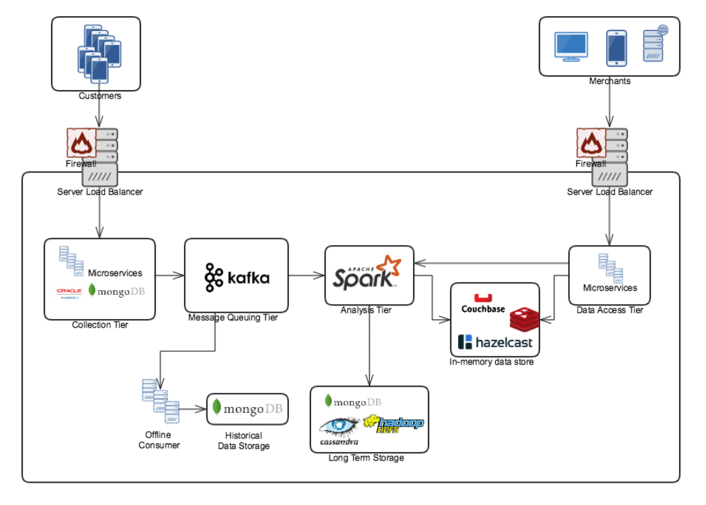

## Requirement Clarifications

### Functional Requirements

- Provide metrics to Merchants
- Support time-series based Read/Query patterns of metrics
- Historical data should be accessible
- Reprocess events in case of system failure

### Non-Functional Requirments

- Metrics are provided with at most one hour delay from event occur
- Large Write : Billions of write events per day
- Large Read/Query :  Millions of merchants perform Read/Query
- High Availability : Run with minimum downtime

### Extended Requirements

These more detailed requirements based on the original requirement, and some of them are based on usecase assumption.

- Merchants will access via Web client
- Our metrics should also be accessible through REST API
- Query type will be both point query and time-series based range query (including Ad-hoc query on analysis processor)
- Analsis report will be updated in every 10 minutes
- For simplicity of capacity estimation, suppose we produce 1 fixed format of statistical analytic result (1KB avg.), which will become a root of other report formats
- The write event will should be processed 'at least once' in any cases. The system does not need to gurantee exactly once semantics, so the underlying job should be idempotent

## Capacity Estimation

This section estimate the base scale of the system.   
Scaling, Partitioning, Load Balancing and Caching of system will base on this estimation.

### Traffic estimates

Assuming 30G (30 billion) write events per day
- Write QPS : 30G / (24 * 3600 seconds) = ~350K/s

Assuming 100M of merchants perform 10 times of read query per day
- Read QPS : 100M * 10 / (24 * 3600 seconds) = ~12K/s

### Storage estimates

Assuming we store every events for 5 years in the first layer of permenant storage.   

Since we have 30G of write data per day, 
- Number of event per year : 30G * 365 days = ~11T/year

Assuming average size of event is 1K, 
- Volume of data for 5 years : 11T * 5 years * 1K = 55P (55 * 10^15)

The data can be compressed, but will not consider this as it depends on compression algorithm of data store or middleware.

_If necessary, we can persist some of the analysis report as well as the write event. More storage is required for this._ 

### Bandwidth estimates

Since write QPS is 350K/s and the size of data is 1K,
- Total incomming data per second : 350K/s * 1K = 350G/s

Since read QPS is 12K/s,
- Total outgoing data per second : 12K/s * 1K = 12G/s

### Memory estimates

The data as a result of analysis can be stored in memory such as distributed cache, in-memory database grid and embedded database of analysis processor.   
This section will assume that we use distributed cache server to hold certain period of analysis report.

There can be various format of analysis report in real world anlysis system. However as mentioned in 'Extended Requirement' section, this section will assume that each analysis report is just 1K of statistical data for past 10 minutes.

Assuming the size of each analysis report as 100K,
- Size of analysis report per week : 100K * 6 * 24 hours * 7 days = ~100G per week

If we need to cache raw level of analysis report for 4 weeks, we need 400G of memory in total
- Size of analysis report for 4 weeks : 100G/week * 4 weeks = 400G

### High level estimates result

Following table shows the breif capacity estimation of analysis system.

| Unit | Amount |
| --- | --- |
| Write QPS | 350K/s |
| Read QPS | 12K/s |
| Storage for 5 years of write event | 55PB |
| Incoming Bandwidth | 350G/s |
| Outgoing Bandwidth | 12/s |
| Cache Memory | 400GB |

### Database Design

When choosing long-term database, below points from requirement should be considered.

1. We need to store big amount of data   
  -> Storage should be scalable, Horizontal Partitioning (Sharding) is required
2. The amount of each object is small (1K by avg)  
  -> Vertical partitioning is not required
3. It's more important to have Partition tolerance, Available system than having high Consistency on distributed system   
  -> DBMS focusing on AP system is preferred (HDFS, Cassandra, or NoSQL such as MongoDB)

### Data Modeling

Data modeling is important for high scaled system, as it is directly related to how efficiently partitioning and clustering can performed.   

Informations like user gender, age, location, etc can provide business insight to merchants and need to be included.   
However sensitive data will not included unless for special reason.   
Data structure example : 
- User : User ID, Email, DoB, User grade, Gender, Country, Device info etc
- Payment Event : Amount, Payment Method, Point usage, Point allocation, Timestamp
- Merchant : Merchant ID, Merchant grade, Location, Businees Type (restaurant, hotel, etc)

Primary Key (Event ID) can be generated from the combination of user ID and timestamp, or from the Key Generation Service with base 64 encoding.   
The randomly generated hash key from KGS will be better choice to support sharding.    
If PK is used as shard key and it includes business value such as timestamp, then the data will not be equally  balanced across multiple shard servers unless using hash algorithm one more time.

To support time-series based range query efficiently, time data should be persisted in timestamp rather than [ISO 8601](https://en.wikipedia.org/wiki/ISO_8601) format.    

## Architecture Design

The analytic system should be near real-time service (or streaming data system) with clients that consumes data.

High level architecture of analysis system is as below : 

### Collection tier

The source of write event (PayPay app) will send request to the collection tier, which is the entry of the analysis system. 
This tier can be composed with multiple Microservices, such as authentication, authorization services as well as services sending write event to message queuing tier.   

For the communication between the event source and collection tier, simple request / response pattern can normally used, with REST API over HTTP.

Each of services can horizontaly scaled easily, as they don't (and should not) hold any state.

Some of the database support feature such as MongoDB's Change Streams or Oracle GoldenGate, to send event when the state of database object has changed.   
With this feature, services does not need to send request to the next tier, and database will automatically send an event to message queue tier when database object state changed.   
One big advantage of this feature is on fault tolerance.

#### Fault Tolerance

In order not to lose data when services on collection tier, solid logging protocol is required, so that event can be reproduced when services on collection tier crashed.

One big advantage of using event from database (Change Streams, GoldenGate) is that when the event couldn't reached to the broker due to any reason (network failure, broker crashed, etc), the DBMS will aware of this and gurantees each of event reachs to the broker exactly once when failure becomes stable.

#### Load Balancer

Server side Load Balancer, reverse proxy, firewall should be placed between collection tier and outside of network.   
Servers from Cisco, Nginx, Amazon ELB, etc can be used for this purpose.   
Round Robing approach will work for balancing the load.   

#### Security

The SLB server will be located in the DMZ security zone.

### Message Queuing tier

Streaming system usually span across many servers, so decoupling of the various components is crucial.   
Message queueing system such as Apache Kafka, RabbitMQ, ActiveMQ, etc are supporting this.

Apache Kafka provides high performance with topic and partitioin feature.    
As each of write event does not required to be kept in sequential order, we can easily scale with additional Kafka topic and partition within a Kafka cluster.

#### Fault Tolerance

Apache Kafka provides high availability with replication cluster and the Zookeeper managing the cluster.   

But still, message can fail due to the speed different between producer producing message and consumer consumming message, and message will lost in this case.   
Message Queues such as Kafka has fault tolerance with this by using durable messaging.   
With durable message, consumer can read message slowly, and even can being in offline and perform batch process when it necessary.

When data lost due to network failure, broker crashed, message queue crashed or consumer crashed, offline consumer can perform batch job from the durable message of historical data store.  

Message should be processed 'at least once' basis when it crashed due to any reason.   
Additional Message auditing is required for this purpose.

### Analysis tier

Continuous query model is required to process data in flight.

As a consumer of message queue tier, analysis tier should keep up with the pressure and evaluate the new data.

Many open source products support distributed analysis tier, such as Spark, Storm, Flink, and Samza, all from Apache.   
Applications using Spark Streams can perform anlysis.

The data should be persisted in long-term storage after being processed in order to handle various kind of client's query.   
HDFS, Cassandra or even MongoDB can be an option for this.

#### Fault Tolerance

Most of OSS product support high resilience with replica cluster and Zookeeper if it is Apache product.

### In-memory Data Store (Caching)

In capacity estimation section, we've calculated the volume of analysis report for past 4 weeks is 400GB.

Assuming our server has 256GB of memory, at least 2 distributed cache server is necessary to hold analysis report for past 4 weeks.   
Cache eviction policy is based on TTL.

We can put more cache server into the distributed cache cluster, to cache various format of analysis report or older data than 4 weeks.    
Cache eviction policy can be LRU in this case.

Distributed cache, in-memory database grid or even embedded database within analysis processor can be used for this purpose (Memcached, Redis, Hazelcast, MemSQL, Couchbase, etc).   

#### Fault Tolerance 

Replicated cache server is not required as there are already backup in long-term storage.

### Data Access tier

Merchants will access via Web client.   
Our metrics should also be accessible through REST API.   
These can be implemented as independent Microservices which can scalse easily.  

If cache miss occurs with the query from merchants, analysis tier will process with the data from long-term storage to return query.

#### Falut Tolerance

Strict logging protocol is required.

#### Load Balancer

Server side Load Balancer, reverse proxy, firewall should be placed between data access tier and outside of network.   
Servers from Cisco, Nginx, Amazon ELB, etc can be used for this purpose.   
Round Robing approach will work for balancing the load.   

#### Security

The SLB server will be located in the DMZ security zone.